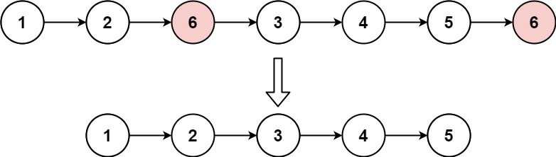

# Remove Linked List Elements

> [!NOTE]
> [Remove Linked List Elements](https://leetcode.com/explore/learn/card/linked-list/219/classic-problems/1207/)

Given the `head` of a linked list and an integer `val`, remove all the nodes of the linked list that has `Node.val == val`, and _return the new head_.

### Examples

#### Example 1:


> **Input**: `head = [1,2,6,3,4,5,6], val = 6`<br/>
> **Output**: `[1,2,3,4,5]`

#### Example 2:

> **Input**: `head = [], val = 1`<br/>
> **Output**: `[]`

#### Example 3:

> **Input**: `head = [7,7,7,7], val = 7`<br/>
> **Output**: `[]`

#### Constraints:

- The number of nodes in the list is in the range `[0, 10⁴]`.
- `1 <= Node.val <= 50`
- `0 <= val <= 50`

## Solutions

### Solution 1

```java
public ListNode removeElements(ListNode head, int val) {
    ListNode dummyHead = new ListNode(0);
    ListNode dummyHeadCurrent = dummyHead;
    ListNode current = head;
    while (current != null) {
        if (current.val != val) {
            dummyHeadCurrent.next = new ListNode(current.val);
            dummyHeadCurrent = dummyHeadCurrent.next;
        }
        current = current.next;
    }
    return dummyHead.next;
}
```

#### Complexities

- `Time Complexity`: O(n)
    - where `n` is the number of nodes in the linked list.
    - This is because we iterate through each node in the linked list once to check if its value is equal to the given value.
- `Space Complexity`: O(n)
    - This is because we are creating a new linked list to store the nodes that do not have the given value.
    - The space used is proportional to the number of nodes in the original linked list that do not have the given value.

### Solution 2

```java
public ListNode removeElements(ListNode head, int val) {
    ListNode dummyHead = new ListNode(0);
    dummyHead.next = head;
    ListNode previous = dummyHead;
    ListNode current = previous.next;
    while (current != null) {
        if (current.val == val) {
            previous.next = current.next;
        } else {
            previous = previous.next;
        }
        current = current.next;
    }
    return dummyHead.next;
}
```

#### Complexities

- `Time Complexity`: O(n)
    - where `n` is the number of nodes in the linked list.
    - This is because we iterate through each node in the linked list once to check if its value is equal to the given value and remove it if necessary.
- `Space Complexity`: O(1)
    - This is because we are using a constant amount of extra space, regardless of the size of the input linked list.
    - We only use a constant number of pointers to keep track of the current and previous nodes.

### Solution 3

```java
public ListNode removeElements(ListNode head, int val) {
    // If head is null, return null
    if (head == null) {
        return null;
    }
    
    // Set the next to sub list after removing elements
    head.next = removeElements(head.next, val);
    
    // If head.val = val, skip head and return next, else return head
    return head.val == val ? head.next : head;
}
```

#### Complexities

- `Time Complexity`: O(n)
  - where `n` is the number of nodes in the linked list.
  - This is because we are recursively traversing the linked list and checking each node's value to see if it matches the given value to be removed.
- `Space Complexity`: O(n)
  - This is because the recursive calls will consume space on the call stack proportional to the number of nodes in the linked list.

> [!TIP]
> `Solution 1` needs extra space to create the nodes.<br/>
> `Solution 3` needs extra space to store the recursion on the stack.<br/>
> `Solution 2` performs the removal in constant space.<br/>
> All solutions have the same complexity.
