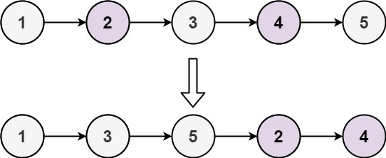
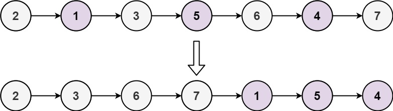

# Odd Even Linked List

> [!NOTE]
> [Odd Even Linked List](https://leetcode.com/explore/learn/card/linked-list/219/classic-problems/1208)

Given the `head` of a singly linked list, group all the nodes with odd indices together followed by the nodes with even indices, and return the reordered list.

The **first** node is considered **odd**, and the **second** node is **even**, and so on.

Note that the relative order inside both the even and odd groups should remain as it was in the input.

You must solve the problem in `O(1)` extra space complexity and `O(n)` time complexity.

### Examples

#### Example 1:


> **Input**: `head = [1,2,3,4,5]`<br/>
> **Output**: `[1,3,5,2,4]`

#### Example 2:


> **Input**: `head = [2,1,3,5,6,4,7]`<br/>
> **Output**: `[2,3,6,7,1,5,4]`

#### Constraints:

- The number of nodes in the linked list is in the range `[0, 10⁴].
- `-10⁶ <= Node.val <= 10⁶`

## Solutions

### Solution 1

```java
public ListNode oddEvenList(ListNode head) {
    ListNode odd = null;
    ListNode even = null;
    int counter = 1;
    ListNode current = head;
    ListNode firstOdd = null;
    ListNode firstEven = null;
    while (current != null) {
        // Track even nodes separately
        if (counter % 2 == 0) {
            if (even == null) {
                even = current;
                // Capture the first even, this is needed to be added to the end of the odd nodes.
                firstEven = current;
            } else {
                even.next = current;
                even = even.next;
            }
        } else { // Track odd nodes separately
            if (odd == null) {
                odd = current;
                // Capture the first odd node, this would be the new head.
                firstOdd = current;
            } else {
                odd.next = current;
                odd = odd.next;
            }
        }
        counter++;
        current = current.next;
    }
    // If odd is not null, set the tail of odd to first even.
    if (odd != null) {
        odd.next = firstEven;
    }
    // If even is not null, set the next of even to null indicating end of the list.
    if (even != null) {
        even.next = null;
    }
    return firstOdd;
}
```

#### Complexities

- `Time Complexity`: O(n)
    - where `n` is the number of nodes in the linked list.
    - This is because we iterate through each node in the linked list exactly once.
- `Space Complexity`: O(1)
    - This is because we are using a constant amount of extra space regardless of the size of the input linked list.

### Solution 2

```java
public ListNode oddEvenList(ListNode head) {
    if (head == null || head.next == null) {
        return head;
    }
    ListNode odd = head;
    ListNode even = head.next;
    ListNode firstEven = head.next;
    while (even != null && even.next != null) {
        odd.next = even.next;
        odd = odd.next;
        even.next = odd.next;
        even = even.next;
    }
    odd.next = firstEven;
    return head;
}
```

#### Complexities

- `Time Complexity`: O(n)
    - where `n` is the number of nodes in the linked list.
    - This is because we iterate through the entire linked list once to rearrange the nodes into odd and even positions.
- `Space Complexity`: O(1)
    - This is because we are only using a constant amount of extra space, regardless of the size of the input linked list.

> [!TIP]
> ?