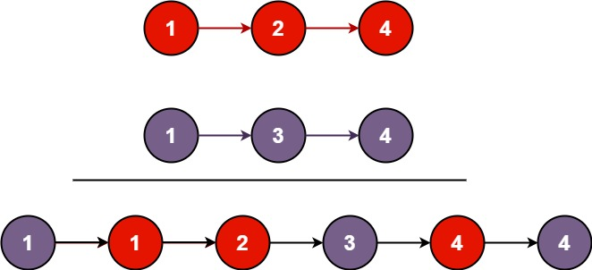

# Problem 21. Merge Two Sorted Lists

> [!NOTE]
> [21. Merge Two Sorted Lists](https://leetcode.com/problems/merge-two-sorted-lists/description/?envType=study-plan-v2&envId=top-interview-150)

You are given the heads of two sorted linked lists `list1` and `list2`.

Merge the two lists into one **sorted** list. The list should be made by splicing together the nodes of the first two lists.

Return _the head of the merged linked list_.

### Examples

#### Example 1:


> **Input**: `list1 = [1,2,4], list2 = [1,3,4]`<br/>
> **Output**: `[1,1,2,3,4,4]`

#### Example 2:

> **Input**: `list1 = [], list2 = []`<br/>
> **Output**: `[]`

#### Example 2:

> **Input**: `list1 = [], list2 = [0]`<br/>
> **Output**: `[0]`

#### Constraints:

- The number of nodes in both lists is in the range `[0, 50]`.
- `-100 <= Node.val <= 100`
- Both `list1` and `list2` are sorted in **non-decreasing** order.

## Solutions

### Solution 1

```java
/**
 * Definition for singly-linked list.
 * public class ListNode {
 *     int val;
 *     ListNode next;
 *     ListNode() {}
 *     ListNode(int val) { this.val = val; }
 *     ListNode(int val, ListNode next) { this.val = val; this.next = next; }
 * }
 */
class Solution {
    public ListNode mergeTwoLists(ListNode list1, ListNode list2) {
        ListNode mergedListHead = new ListNode(0);
        ListNode mergedListTail = mergedListHead;
        while (list1 != null || list2 != null) {
            if (list2 == null || (list1 != null && list1.val <= list2.val)) {
                mergedListTail.next = new ListNode(list1.val);
                list1 = list1.next;
            } else {
                mergedListTail.next = new ListNode(list2.val);
                list2 = list2.next;
            }
            mergedListTail = mergedListTail.next;
        }
        return mergedListHead.next;
    }
}
```

#### Complexities

- `Time Complexity`: O(n + m)
    - where `n` and `m` are the lengths of the two input `lists`.
    - This is because we iterate through both lists once to merge them.
- `Space Complexity`: O(n + m)
    - This is because we are creating a new `ListNode` for each element in the merged list.

### Solution 2

```java
/**
 * Definition for singly-linked list.
 * public class ListNode {
 *     int val;
 *     ListNode next;
 *     ListNode() {}
 *     ListNode(int val) { this.val = val; }
 *     ListNode(int val, ListNode next) { this.val = val; this.next = next; }
 * }
 */
class Solution {
    public ListNode mergeTwoLists(ListNode list1, ListNode list2) {
        ListNode mergedListHead = new ListNode(0);
        ListNode mergedListTail = mergedListHead;
        while (list1 != null || list2 != null) {
            if (list2 == null || (list1 != null && list1.val <= list2.val)) {
                mergedListTail.next = list1;
                list1 = list1.next;
            } else {
                mergedListTail.next = list2;
                list2 = list2.next;
            }
            mergedListTail = mergedListTail.next;
        }
        return mergedListHead.next;
    }
}
```

#### Complexities

- `Time Complexity`: O(n + m)
    - where `n` and `m` are the lengths of the two input `lists`.
    - This is because we iterate through both lists once to merge them together.
- `Space Complexity`: O(1)
    - This is because we are not using any extra space that grows with the input size.
    - We are simply modifying the pointers of the existing nodes to create the merged list.

> [!TIP]
> `Solution 1` and `Solution 2` are similar except for the fact that `Solution 2` doesn't create new nodes.
> `Solution 2` reuses the original nodes making it run in lower space complexity.
