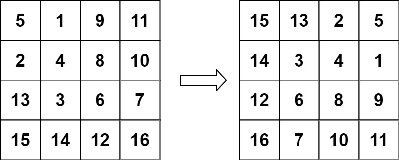

# Problem 48. Rotate Image

> [!NOTE]
> [48. Rotate Image](https://leetcode.com/problems/rotate-image/description/?envType=study-plan-v2&envId=top-interview-150)

You are given an `n x n` 2D matrix representing an image, rotate the image by **90** degrees (clockwise).

You have to **rotate the image in-place**, which means you have to modify the input 2D matrix directly.

DO NOT allocate another 2D matrix and do the rotation.

### Examples

#### Example 1:

> **Input**: `matrix = [[1,2,3],[4,5,6],[7,8,9]]`<br/>
> **Output**: `[[7,4,1],[8,5,2],[9,6,3]]`<br/>
> 

#### Example 2:

> **Input**: `matrix = [[5,1,9,11],[2,4,8,10],[13,3,6,7],[15,14,12,16]]`<br/>
> **Output**: `[[15,13,2,5],[14,3,4,1],[12,6,8,9],[16,7,10,11]]`<br/>
> 

#### Constraints:

- `n == matrix.length == matrix[i].length`
- `1 <= n <= 20`
- `-1000 <= matrix[i][j] <= 1000`

## Solutions

### Solution 1

```java
public void rotate(int[][] matrix) {
    int colEndIdx = matrix.length - 1;
    int rowEndInd = matrix.length / 2;
    int r = 0;
    while (r < rowEndInd) {
        int c = r;
        while (c < colEndIdx) {
            // Save the top left.
            int topLeft = matrix[r][c];
            // Copy bottom left to top left
            matrix[r][c] = matrix[colEndIdx - c + r][r];
            // Copy bottom right to bottom left
            matrix[colEndIdx - c + r][r] = matrix[colEndIdx][colEndIdx - c + r];
            // Copy top right to bottom right
            matrix[colEndIdx][colEndIdx - c + r] = matrix[c][colEndIdx];
            // Copy saved top left to top right
            matrix[c][colEndIdx] = topLeft;
            c++;
        }
        r++;
        colEndIdx--;
    }
}
```

#### Complexities

- `Time Complexity`: O(n^2)
    - nested loops that iterate through the elements of the matrix
- `Space Complexity`: O(1)
    - Don't use any extra space

> [!TIP]
> An alternate strategy with similar complexities is to transpose the matrix first and then reverse the order of each row.
