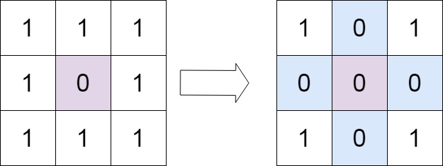

# Problem 73. Set Matrix Zeroes

> [!NOTE]
> [73. Set Matrix Zeroes](https://leetcode.com/problems/set-matrix-zeroes/description/?envType=study-plan-v2&envId=top-interview-150)

Given an `m x n` integer matrix `matrix`, if an element is `0`, set its entire `row` and `column` to `0`'s.
You must do it **in place**.

**Follow up**:

- A straightforward solution using `O(mn)` space is probably a bad idea.
- A simple improvement uses `O(m + n)` space, but still not the best solution.
- Could you devise a constant space solution?

### Examples

#### Example 1:

> **Input**: `matrix = [[1,1,1],[1,0,1],[1,1,1]]`<br/>
> **Output**: `[[1,0,1],[0,0,0],[1,0,1]]`<br/>


#### Example 2:

> **Input**: `matrix = [[0,1,2,0],[3,4,5,2],[1,3,1,5]]`<br/>
> **Output**: `[[0,0,0,0],[0,4,5,0],[0,3,1,0]]`<br/>


#### Constraints:

- `m == matrix.length`
- `n == matrix[0].length`
- `1 <= m, n <= 200`
- `-231 <= matrix[i][j] <= 231 - 1`

## Solutions

### Solution 1

```java
public void setZeroes(int[][] matrix) {
    int m = matrix.length;
    int n = matrix[0].length;
    boolean[] zeroRows = new boolean[m];
    boolean[] zeroCols = new boolean[n];
    for (int r = 0; r < m; r++) {
        for (int c = 0; c < n; c++) {
            if (matrix[r][c] == 0) {
                zeroRows[r] = true;
                zeroCols[c] = true;
            }
        }
    }

    for (int r = 0; r < m; r++) {
        for (int c = 0; c < n; c++) {
            if (zeroRows[r] || zeroCols[c]) {
                matrix[r][c] = 0;
            }
        }
    }
}
```

#### Complexities

- `Time Complexity`: O(m*n)
  - where `m` is the number of rows in the matrix and `n` is the number of columns 
  - iterate through the entire matrix twice to identify the rows and columns that need to be zeroed out
- `Space Complexity`: O(m + n)
  - use two boolean arrays of length `m` and `n` to keep track of which rows and columns need to be zeroed out

### Solution 2

```java
public void setZeroes(int[][] matrix) {
    int m = matrix.length;
    int n = matrix[0].length;
    boolean doesFirstRoweHasZero = false;
    boolean doesFirstColHasZero = false;
  
    //1. check if the first row has a zero
    for (int c = 0; c < n && !doesFirstRoweHasZero; c++) {
        doesFirstRoweHasZero = matrix[0][c] == 0;
    }

    //2. check if the first column has a zero
    for (int r = 0; r < m && !doesFirstColHasZero; r++) {
        doesFirstColHasZero = matrix[r][0] == 0;
    }

    //3. iterate through the rest (starting at 1,1) of the matrix
    // and if [r,c] = 0, then set the 0th c and 0th r as zero.
    for (int r = 1; r < m; r++) {
        for (int c = 1; c < n; c++) {
        if (matrix[r][c] == 0) {
            matrix[r][0] = 0;
            matrix[0][c] = 0;
          }
        }
    }

    //4. set the zeros in the matrix (starting at 1,1) if the first row or column has a zero
    for (int r = 1; r < m; r++) {
        for (int c = 1; c < n; c++) {
          if (matrix[r][0] == 0 || matrix[0][c] == 0) {
            matrix[r][c] = 0;
        }
        }
    }

    //5. set the zeros in the first row if the flag was set above
    for (int c = 0; c < n && doesFirstRoweHasZero; c++) {
        matrix[0][c] = 0;
    }

    //6. set the zeros in the first col if the flag was set above
    for (int r = 0; r < m && doesFirstColHasZero; r++) {
        matrix[r][0] = 0;
    }
}
```

#### Complexities

- `Time Complexity`: O(m*n)
  - where `m` is the number of rows in the matrix and `n` is the number of columns
  - iterate through the entire matrix twice to mark the rows and columns that need to be zeroed out
- `Space Complexity`: O(1)
  - use constant amount of extra space
