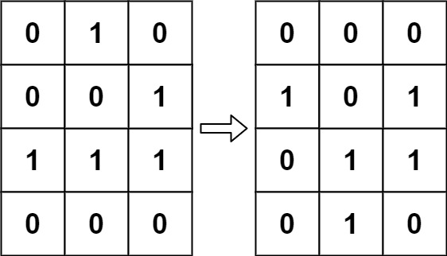

# Problem 289. Game of Life

> [!NOTE]
> [289. Game of Life](https://leetcode.com/problems/game-of-life/description/?envType=study-plan-v2&envId=top-interview-150)

According to [Wikipedia's article](https://en.wikipedia.org/wiki/Conway%27s_Game_of_Life): "The **Game of Life**, also known simply as **Life**, is a cellular automaton devised by the British mathematician John Horton Conway in 1970."

The board is made up of an `m x n` grid of cells, where each cell has an initial state: live (represented by a `1`) or dead (represented by a `0`). Each cell interacts with its [eight neighbors](https://en.wikipedia.org/wiki/Moore_neighborhood) (horizontal, vertical, diagonal) using the following four rules (taken from the above Wikipedia article):

1. Any live cell with fewer than two live neighbors dies as if caused by under-population.
2. Any live cell with two or three live neighbors lives on to the next generation.
3. Any live cell with more than three live neighbors dies, as if by over-population.
4. Any dead cell with exactly three live neighbors becomes a live cell, as if by reproduction.

The next state is created by applying the above rules simultaneously to every cell in the current state, where births and deaths occur simultaneously. Given the current state of the `m x n` grid `board`, return the next state.

**Follow up:**

- Could you solve it in-place? Remember that the board needs to be updated simultaneously: You cannot update some cells first and then use their updated values to update other cells.
- In this question, we represent the board using a 2D array. In principle, the board is infinite, which would cause problems when the active area encroaches upon the border of the array (i.e., live cells reach the border). How would you address these problems?

### Examples

#### Example 1:

> **Input**: `board = [[0,1,0],[0,0,1],[1,1,1],[0,0,0]]`<br/>
> **Output**: `[[0,0,0],[1,0,1],[0,1,1],[0,1,0]]`<br/>


#### Example 2:

> **Input**: `board = [[1,1],[1,0]]`<br/>
> **Output**: `[[1,1],[1,1]]`<br/>


#### Constraints:

- `m == board.length`
- `n == board[i].length`
- `1 <= m, n <= 25`
- `board[i][j] is 0 or 1.`

## Solutions

### Solution 1

```java
public void gameOfLife(int[][] board) {
    int rowCount = board.length;
    int colCount = board[0].length;
    int[][] nextState = new int[rowCount][colCount];

    for (int r = 0; r < rowCount; r++) {
        for (int c = 0; c < colCount; c++) {
            nextState[r][c] = board[r][c];
            int liveNeighborCells = computeLiveNeighborCells(board, r, c, rowCount, colCount);
            if (board[r][c] == 1 && liveNeighborCells < 2 || liveNeighborCells > 3) {
                nextState[r][c] = 0;
            } else if (board[r][c] == 0 && liveNeighborCells == 3) {
                nextState[r][c] = 1;
            }
        }
    }
    for (int r = 0; r < rowCount; r++) {
        System.arraycopy(nextState[r], 0, board[r], 0, colCount);
    }
}

private int computeLiveNeighborCells(int[][] board, int r, int c, int rowCount, int colCount) {
    int liveCells = 0;
    for (int cellR = r - 1; cellR <= r + 1; cellR++) {
        if (cellR > -1 && cellR < rowCount) {
            for (int cellC = c - 1; cellC <= c + 1; cellC++) {
                if (cellC > -1 && cellC < colCount && !(r == cellR && c == cellC)) {
                    liveCells += board[cellR][cellC];
                }
            }
        }
    }
    return liveCells;
}
```

#### Complexities

- `Time Complexity`: O(m * n)
    - where `m` is the number of `rows` in the `board` and `n` is the number of `columns` in the `board`.
    - iterate through each cell in the `board` once to calculate the next state based on the rules of the game.
- `Space Complexity`: O(m * n)
    - create a new 2D array of the same size as the board to store the next state

### Solution 2

```java
public void gameOfLife(int[][] board) {
    int willDie = 10;
    int willLive = 20;
    for (int r = 0; r < board.length; r++) {
        for (int c = 0; c < board[r].length; c++) {
            int liveNeighborCells = 0;
            for (int cellR = r - 1; cellR <= r + 1; cellR++) {
                if (cellR > -1 && cellR < board.length) {
                    for (int cellC = c - 1; cellC <= c + 1; cellC++) {
                        if (cellC > -1 && cellC < board[cellR].length && !(r == cellR && c == cellC)) {
                            if (board[cellR][cellC] >= willLive) {
                                liveNeighborCells += board[cellR][cellC] - willLive;
                            } else if (board[cellR][cellC] >= willDie) {
                                liveNeighborCells += board[cellR][cellC] - willDie;
                            } else {
                                liveNeighborCells += board[cellR][cellC];
                            }
                        }
                    }
                }
            }

            if (board[r][c] == 1 && liveNeighborCells < 2 || liveNeighborCells > 3) {
                board[r][c] += willDie;
            } else if (board[r][c] == 0 && liveNeighborCells == 3) {
                board[r][c] += willLive;
            }
        }
    }

    for (int r = 0; r < board.length; r++) {
        for (int c = 0; c < board[r].length; c++) {
            if (board[r][c] >= willLive) {
                board[r][c] = 1;
            } else if (board[r][c] >= willDie) {
                board[r][c] = 0;
            }
        }
    }
}
```

#### Complexities

- `Time Complexity`: O(m * n)
    - where `m` is the number of `rows` and `n` is the number of `columns` in the `board`.
    - iterate through each cell in the board and for each cell, we iterate through its neighbors to count the number of live neighbor cells.
- `Space Complexity`: O(1)
    - not using any extra space that grows with the input size.
